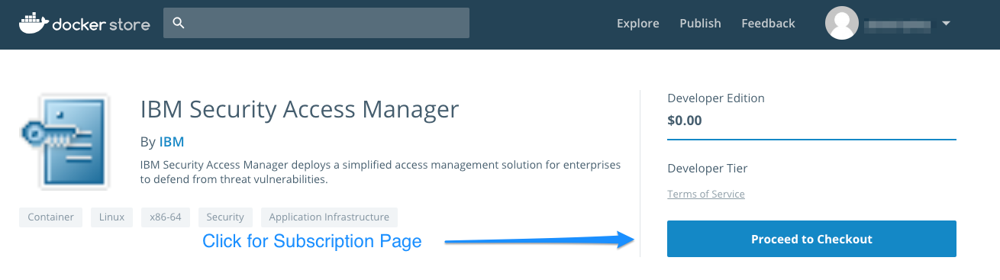
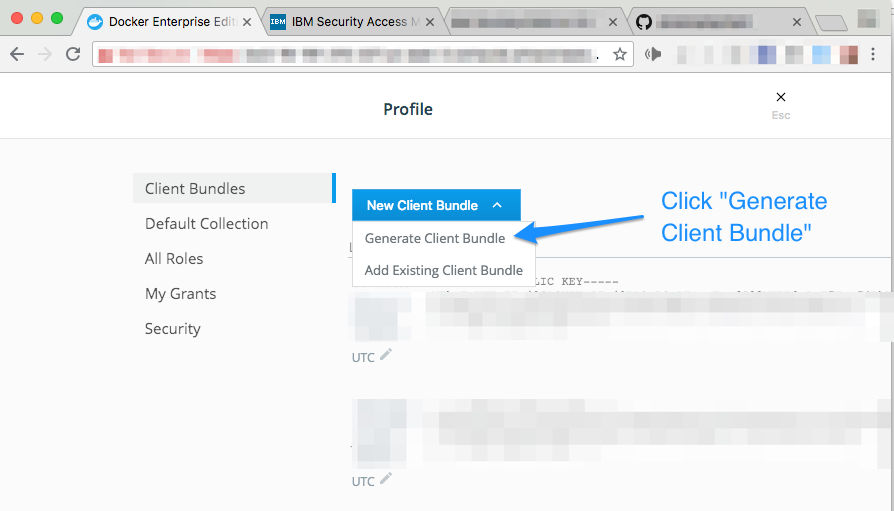

## Overview

Docker Solution Briefs enable you to integrate the Docker Enterprise Edition (EE) container platform with popular 3rd party ecosystem solutions for networking, load balancing, storage, logging, monitoring, and access management. This Solution Brief describes basic information about how to obtain, configure, and deploy IBM Security Access Manager via Kubernetes on Docker Enterprise Edition.

This Solution Brief follows the structure, setup, and process described by IBM's blog [Running ISAM on IBM Cloud](https://www.ibm.com/blogs/sweeden/running-isam-ibm-cloud/).  This blog explains, in detail, the purpose and function of each command of the deployment.  The purpose of this Solution Brief is to layer-on the steps to implement IBM Security Access Manager 9.0.5.0 on Docker Enterprise Edition 2.0.  To simplify the process and avoid overlap and redundancy, this guide provides scripts that can be used for easy setup. 

Whereas this Solution Brief focuses on orchestration with Kubernetes, a Swarm orchestrator version of IBM Security Access Management for Docker EE 17.06 is available at the [Docker Success Center](https://success.docker.com)

> Information on IBM Security Access Manager is provided by Docker as a known, working configuration for Docker Enterprise Edition 2.0. Docker does not support IBM Security Access Manager. Please contact the vendor approved support methods if you have any questions or problems with them.

## IBM Security Access Manager Overview

IBM Security Access Manager (ISAM) is a modular, integrated access management solution that secures customer and employee access to web, mobile, and cloud applications and APIs. It provides multi-factor authentication, risk-based authentication, web-application protection, and identity federation. ISAM allows organizations to deliver the seamless experiences required to embrace digital transformation without sacrificing security.

IBM Security Access Manager offers the following features:

- Authentication - Provides a wide range of built-in authenticators and supports external authenticators.
- Federation – Delivers SSO to cloud or on-premise applications across separately managed domains.
- Authorization - Provides permit and deny decisions for protected resource requests in the secure domain through the authorization API.
- Manages secure access to private internal network-based resources by using the public Internet's broad connectivity and ease of use with a corporate firewall system.

From Docker Store, users can obtain IBM Security Access Manager and deploy it within their Docker Enterprise Edition infrastructure. Docker Enterprise Edition can be used to manage, scale, and upgrade the environment depending on the needs of the local deployment.

## Architecture

The following architecture diagram shows the containers that are essential to the installation, configuration, and operation of IBM Security Access Manager.  Each box represents one container.  The `isamconfig` container manages the overall configuration of the IBM Security Access Manager environment.  All configuration changes are passed to `isamconfig` and then pulled by `isamwebseal` and `isamruntime` containers.  IBM has provided three separate `yaml` files that deploy these container services and enables a web-based Local Management Interface (LMI) specific for IBM Security Access Manager.  This guide will describe the steps necessary to establish the LMI.  Futher configuration and "day 2" procedures are described in the [Running ISAM on IBM Cloud](https://www.ibm.com/blogs/sweeden/running-isam-ibm-cloud/) blog.


## Prerequisites

The following are required for this Solution Brief.

- [Docker Community Edition for Mac 18.05 edge or above](https://store.docker.com/editions/community/docker-ce-desktop-mac)
- [Docker Enterprise Edition 2.0 UCP 3.0.2](https://store.docker.com/search?offering=enterprise&type=edition)
- Free subscription to the [IBM Security Access Manager 9.0.5.0](https://store.docker.com/images/ibm-security-access-manager) Docker image.
- [IBM ISAM OpenLDAP 9.0.5](https://hub.docker.com/r/ibmcom/isam-openldap/)
- [IBM ISAM PostgreSQL 9.0.5](https://hub.docker.com/r/ibmcom/isam-postgresql/)
- [IBM Security Access Manager openldap.yaml, postgres.yml, and isamconfig.yaml](https://github.com/powersplay/isam)
- [isam-deploy - script for auto deployment](https://github.com/powersplay/isam)
- [Create Docker ID](https://hub.docker.com/)
- [Subscribe to IBM Security Access on Docker Store](https://store.docker.com/images/ibm-security-access-manager)

Docker Trusted Registry (DTR) is not required for this Solution Brief.

## Configuration and Deployment (Docker Enterprise Edition)

To deploy IBM Security Access Manager on Docker Enterprise Edition 2.0, begin with the provisioning of an appropriate number of instances for the performance and high availability needs.

As an example for this Solution Guide, a 4-node deployment is provisioned consisting of one node for UCP Management and three worker nodes to run the Security Access Manager config, aac, webseal, dsc, Postgres, and LDAP containers. Port 33543 should be configured for internet access for accessing the Local Management Interface. The Postgres and LDAP containers are supplied by IBM as demonstration placeholders so that the basic components of ISAM can be put in place and verified.  These would likely be replaced in an actual customer migration by the production database and LDAP servers after the basic container setup is achieved.

Install and configure Docker Enterprise Edition and IBM Security Manager on Docker Enterprise Edition by using the steps in the following sections.

### Infrastructure or Cloud Service Setup

Provision four or more VM instances within the local infrastructure or using a cloud service provider.  

### Install Docker Enterprise Edition

Log into [store.docker.com](https://store.docker.com) and follow the instructions for subscribing to and installing the [appropriate platform architecture](https://store.docker.com/search?offering=enterprise&type=edition) of Docker Enterprise Edition 2.0 (Free 30 Day Trial is available).  

### Setup Docker for Mac/Linux Environment

1. Open a Terminal window.  Make sure you are logged into Docker (`$ docker login`)  Install the `git` utility if not already installed.

2. Run the commands: 
    ```
    $ git clone https://github.com/powersplay/isam
    $ cd isam
    ```
    
3. If Kubernetes is not already enabled, access the Docker icon in the top menu bar of your desktop, and click on **Preferences**.  Click on **Kubernetes** and choose the **Enable Kubernetes** check box.  Click on **Apply** to restart Docker for Mac with Kubernetes enabled.  <BR> <BR>
 

4. In a browser and using the [Docker ID] used in step 1, log into [Docker Store](https://store.docker.com).  Subscribe to the [IBM Security Access Manager](https://store.docker.com/images/ibm-security-access-manager) image. This image is free. Here are the example steps to subscribe to the image.<BR> <BR>

Subscription Screen:


5. Go to the URL for the UCP management node that was provisioned in the previous section and log into `Admin` (or some valid `username`)
 

6. Check that the Node manager and workers are all setup for "mixed" type workload.
This can be changed by selecting the node and clicking the `Configure` button in the top right corner. (NOTE changing node types requires `Admin` user privileges) <BR>


7. Within UCP, navigate to the `Admin` or `{username}` tab in the upper left corner, and choose **My Profile** from the drop down menu.  <BR>


8. On the **Profile** page, click on **New Client Bundle**. This downloads `client-bundle-{user}.zip` to the local system.


9. In the terminal window, move the client bundle (`ucp-bundle-{username}.zip`) into the `isam` directory and `unzip` the bundle.  Example:
    ```
    $ cp ~/Downloads/ucp-bundle-admin.zip .
    $ unzip ucp-bundle-admin.zip
    ```
10. Execute 
    ```
    $ eval "$(<env.sh)"
    ```
This allows CLI commands to execute against the UCP instance by setting up the appropriate certificates and IP addresses. Additional documentation on the options available can be found on [docs.docker.com](https://docs.docker.com/datacenter/ucp/2.2/guides/user/access-ucp/cli-based-access/#download-client-certificates). 

12. Create a Kubernetes secret.  This enables the image to be pulled as part of the deployment.  Replace the `<USERNAME>`, `<PASSWORD>`, and `<EMAIL_ADDRESS>` below with the credentials from previous steps.
    ```
    $ kubectl create secret docker-registry dockerlogin --docker-username=<USERNAME> --docker-password=<PASSWORD> --docker-email=<EMAIL_ADDRESS>
    ```

## Deploy and Verify the Application

To launch and verify the deployment, navigate to the `isam` directory that contains the `openldap.yaml`, `postgres.yaml`, and `isamconfig.yaml` files. This bash script automates the creation of certificates and launches the containers. Execute:

```
$ ./isam-deploy
  This script performs the orchestration of IBM Security Access Manager on Docker Enterprise Edition 2.0. See https://www.ibm.com/blogs/sweeden/running-isam-ibm-cloud/ for detailed description of each step. Do you want to continue? Y,n
Y
```

Example Output:
```
+++ Create key and certificate files for OpenLDAP

...

Generating a 4096 bit RSA private key
.++
.........................++
writing new private key to 'ldap.key'...

... (other output)

+++ Create a Diffie-Hellman parameter file for OpenLdap
Generating DH parameters, 2048 bit long safe prime, generator 2
This is going to take a long time

... 

NAME                          READY     STATUS    RESTARTS   AGE
isamconfig-65465997dd-9hlwd   1/1       Running   0          21s
openldap-5bb569c584-pplsg     1/1       Running   0          57s
postgresql-8dd9f878c-rwt2g    1/1       Running   0          29s
DONE!!!
```
> After several minutes, the state of the deployment also can be shown through the UCP user interface.  The pod status will show green when the deployment is done.  (Screen refresh may be necessary) 


The ISAM configuration container is now deployed and ready for use.  In a separate browser window, the Local Management Interface login screen (admin/admin) is available at `https://{docker-host}:33543`.  It is from this console that further configuration of the IBM Security Management environment can be achieved. 


## Next Steps

There are several more configuration steps that need to be taken for a fully functional IBM Security Access Manager deployment.  These include:
- Deploying the ISAM Web Reverse Proxy Container
- Deploying the ISAM Runtime Container
- Configuring ISAM through the LMI including re-publishing a snapshot
- Sanity testing a basic Scenario

These steps are described in detail at the [IBM Blog](https://www.ibm.com/blogs/sweeden/running-isam-ibm-cloud/).

## Monitoring and Troubleshooting

Most Kubernetes monitoring and troubleshooting can be accomplished by viewing the log of the `isamconfig` pod.  Under the `Kubernetes` tab in the left hand menu, click on `Pods` then select the `isamconfig` pod.  On the right hand menu a `View Log` button will appear.  Click to inspect the log of this pod.

To learn more about Docker Logging Best Practices, please consult [Docker Reference Architecture: Docker Logging Design and Best Practices](https://success.docker.com/article/logging-best-practices).

## Removing the Environment

The ISAM deployment can be removed from UCP by navigating to the `isam` directory and executing the script:
```
 $ ./delkube
   This script will delete ISAM openldap, postgresql, and isamconfig deployments on the target Docker EE 2.0 System.  Do you want to continue? Y,N Y
```
Example Output:
```
   +++Deleting deployments...
   deployment.extensions "openldap" deleted
   deployment.extensions "postgresql" deleted
   deployment.extensions "isamconfig" deleted
   +++Deleting services...
   service "openldap" deleted
   service "postgresql" deleted
   service "isamconfig" deleted
   +++Deleting secrets...
   secret "openldap-keys" deleted
   secret "postgresql-keys" deleted
   secret "dockerlogin" deleted
   secret "configreader" deleted (slight pause)
   No resources found.

```
The deployment has been retired from the UCP configuration.

## Further Reading and Contacts

Detailed IBM documentation about Docker and Security Access Manager is at [The IBM Knowledge Center](https://www.ibm.com/support/knowledgecenter/SSPREK_9.0.4/com.ibm.isam.doc/admin/concept/con_docker_support.html).

## Additional Solution Briefs

- [Cisco Contiv 1.1.7 Solution Brief for Docker EE 17.06](https://success.docker.com/article/contiv-networking/)
- [VMware VSphere Storage for Docker 2.2.1 Solution Briefing for Docker EE 17.06](https://success.docker.com/article/vsphere-storage/)
- [Splunk Enterprise Solution Brief for Docker EE 17.06](https://success.docker.com/article/splunk-logging/)
- [Grafana/Prometheus Monitoring Solution Brief for Docker EE 17.06](https://success.docker.com/article/grafana-prometheus-monitoring/)
- [NGINX Solution Brief on Docker EE 17.06](https://success.docker.com/article/nginx-load-balancer/)


